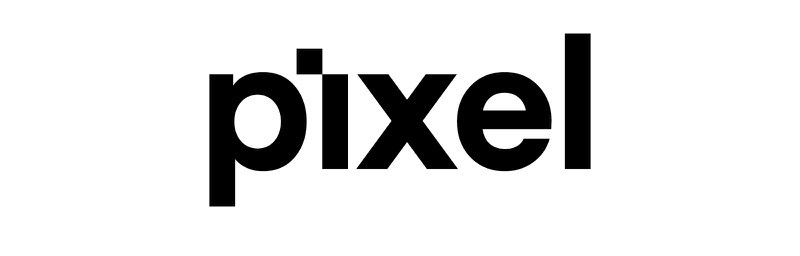

 
 

**I have started on version 2.0.0, which will be made public in soon. When it does, this project will become deprecated**

# The pixel Library

This is a **single file**, **object oriented** library to more easily 
create fast **graphical C++** applications that abstracts the 
creation of windows and makes using opengl much easier. It
currently only supports windows, as it uses the **Win32 API**, but
linux support may come in the future.

It is intended to help newer programmers more easily make their 
first graphical application to learn the basics of 2d graphics, and
later 3d graphics.

## Licensing

The pixel library is hosted on github and released under the MIT license.

## Compiling

This repository contains the **pixel.hpp** header file, which 
should be the only thing needed, as it is a single file solution.
**'opengl32.lib'**, **'gdiplus.lib'**, **'User32.lib'** and **'Gdi32.lib'** 
must be added to your linker's input for it to link properly.

Additionally, a Visual Studio solution is provided with some
**demos** to test the library's functionality, to use them simply
open the solution on **Visual Studio** and select the proper demo
file by editing it's properties and making it a **'C/C++ source
file"**.

## Features

This **library** provides easy creation of **windows** with the use of
the `Window` class. When creating a window, the user must specify
a **cavas size** and **scale**, window **position** and tittle, **drawing mode** 
and whether the user wants a **fullscreen** window and **vsync** enabled.

Serveral **drawing routines** are included, including lines, circles,
rectangles, and triangles. The user may specify a **color** and **aplha** 
values to draw them with. Several color codes are provided already.

The window must be updated in a loop for this library to work properly,
however, this is the only function that **must** be called periodically 
for the window to work. This update is triggered by the `Window::Update()` 
function, which updates the **user input**, **polls system events** and 
pushes the **buffer** into view.

The user may interogate the **mouse position** and **keyboard state** 
with the provided `Window::MousePos()` and `Window::KeyboardKey()` functions.

The current implementation includes a **sprite** class, which can load data
from several types of files. This sprite data is loaded in the **GPU** for 
faster **rendering** and **advanced** transform capabilities.

A more complete **roadmap** can be seen in the trelloo board: https://trello.com/b/aDYGp0Vu/pixel
